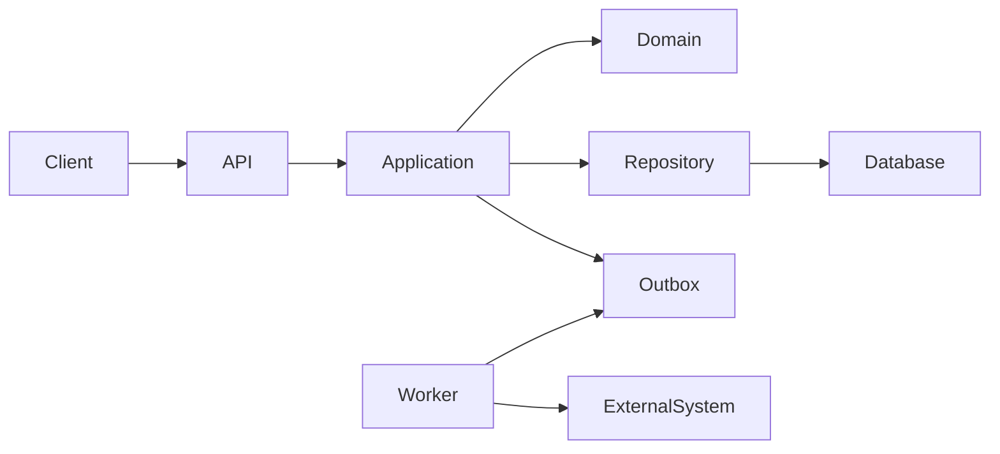

# Building a specification-driven HAL project workflow

This document is a copy/paste reference for an LLM that must set up a new software
project to be built through HAL. It defines the required project documents, their
quality bar, a complete example workflow, PowerShell setup and runner scripts, and
prompts for creating and operating the system.

The intended result is:

```text
project-root/
|-- .hal/
|   `-- workflows/
|       `-- example.yaml
|-- docs/
|   |-- requirements.md
|   |-- architecture.md
|   |-- safety.md
|   `-- implementation-plan.md       # generated per work slice
|-- scripts/
|   |-- setup-hal.ps1
|   |-- run-workflow.ps1
|   |-- workflow-status.ps1
|   `-- verify.ps1
|-- AGENTS.md
|-- backlog.md
|-- hal.yaml
`-- <application files>
```

> HAL repository workflows belong in `.hal/workflows/`, with a leading dot.
> `hal/workflows/` is not the repository workflow directory. The HAL source project
> itself may live elsewhere and be installed into the target project's virtual
> environment.

## 1. Instructions to the setup LLM

Use this instruction block as the controlling prompt when asking another LLM to
create the setup in a new repository:

```text
You are creating a specification-driven HAL workflow for this repository.

First inspect the entire repository, its applicable AGENTS.md files, README,
dependency manifests, tests, CI configuration, existing design documents, and Git
status. Preserve all user changes. Never read, overwrite, stage, or expose .env or
other secret files. Do not invent business rules that cannot be supported by source
material; record them as explicit open questions.

Create or improve these controlled documents:
- docs/requirements.md
- docs/architecture.md
- docs/safety.md
- backlog.md
- AGENTS.md, if it does not already provide adequate repository instructions

Create this orchestration and its Windows runners:
- .hal/workflows/example.yaml
- scripts/setup-hal.ps1
- scripts/run-workflow.ps1
- scripts/workflow-status.ps1
- scripts/verify.ps1
- hal.yaml, only if absent; never place credentials in it

Requirements are the authority for WHAT the system must do. Architecture is the
authority for HOW responsibilities and constraints are allocated. Safety is the
authority for hazards, invariants, fail-safe behavior, and verification. Do not let
the three documents silently contradict one another. Give every requirement,
hazard, verification test, and backlog slice a stable ID, and make their links
machine-searchable.

Derive facts from repository evidence. Mark uncertain material as [INFERRED],
[PROPOSED], or [UNRESOLVED]; mark directly supported material as [OBSERVED]. Cite
repository-relative evidence wherever practical. A proposed behavior must not be
presented as an observed requirement.

The workflow must be bounded, use fresh contexts for independent reviews, separate
planning from implementation, run deterministic verification commands after model
work, and fail closed if the plan is not approved or tests fail. It must not commit,
push, publish, deploy, contact production, alter secrets, or delete untracked files.

Adapt language, package names, test commands, and safety depth to this project.
Retain the control structure and traceability conventions in this reference. Verify
the workflow with `hal workflow inspect example --json`; do not run it until the
user reviews the reported digest, capabilities, commands, and effects.

Before finishing, run the repository's safe read-only/configuration checks, inspect
the final Git diff, run `git diff --check`, and report created files, unresolved
questions, and commands the user should run. Do not commit unless explicitly asked.
```

## 2. Evidence and document conventions

Use stable prefixes chosen for the project. The examples below use `PRJ`:

| Item | ID form | Example |
| --- | --- | --- |
| Functional requirement | `PRJ-FR-NNN` | `PRJ-FR-014` |
| Nonfunctional requirement | `PRJ-NFR-NNN` | `PRJ-NFR-006` |
| Constraint | `PRJ-CON-NNN` | `PRJ-CON-003` |
| Open question | `PRJ-Q-NNN` | `PRJ-Q-011` |
| Hazard | `PRJ-HZ-NNN` | `PRJ-HZ-004` |
| Safety invariant | `PRJ-SI-NNN` | `PRJ-SI-007` |
| Verification test | `PRJ-VT-NNN` | `PRJ-VT-012` |
| Backlog slice | `PRJ-BL-NNN` | `PRJ-BL-005` |

Evidence tags have precise meanings:

- `[OBSERVED]`: directly supported by code, tests, user-provided material, or an
  authoritative source cited in the document.
- `[INFERRED]`: a likely interpretation with the inference and supporting evidence
  stated explicitly.
- `[PROPOSED]`: a design or product choice awaiting acceptance.
- `[UNRESOLVED]`: missing information that requires a named decision owner.
- `[ASSUMPTION]`: a temporary premise used for planning; include its consequence if
  false and its validation method.

Normative language is deliberate: `MUST` is mandatory, `SHOULD` needs a documented
reason to deviate, and `MAY` is optional. Avoid subjective terms such as “fast,”
“secure,” or “user-friendly” unless accompanied by a measurable threshold.

Each controlled document begins with a small metadata table:

```markdown
| Field | Value |
| --- | --- |
| Status | DRAFT / REVIEWED / APPROVED |
| Owner | role or person |
| Last reviewed | YYYY-MM-DD |
| Scope | concise system boundary |
| Depends on | repository-relative paths |
```

Keep a decision log in the relevant document or in `docs/decisions/`. A decision
records the ID, date, status, context, chosen option, alternatives, consequences,
owner, and links to affected requirement/hazard IDs. Never erase a superseded
decision; point it to its replacement.

## 3. Building `docs/requirements.md`

`requirements.md` says what must be true without prematurely choosing internal
implementation details. It should be understandable and reviewable by product,
domain, operations, security, and engineering stakeholders.

### Required structure

```markdown
# System requirements

<metadata table>

## 1. Purpose, goals, and success measures
## 2. Scope and system boundary
### 2.1 In scope
### 2.2 Explicitly out of scope
### 2.3 Actors and external systems
## 3. Evidence sources and confidence
## 4. Glossary and domain rules
## 5. User journeys and operational workflows
## 6. Functional requirements
## 7. Data requirements
## 8. Interfaces and integrations
## 9. Security, privacy, and permissions
## 10. Nonfunctional requirements and service objectives
## 11. Failure, recovery, migration, and compatibility behavior
## 12. Acceptance and release gates
## 13. Assumptions, constraints, and dependencies
## 14. Open questions and decision owners
## 15. Traceability matrix
## 16. Exclusions and deferred work
```

### Requirement record template

```markdown
### PRJ-FR-001 — Short imperative title

- Evidence: [OBSERVED] `path/to/source:section` or a concise source description
- Statement: The system MUST ...
- Rationale: Why this behavior exists.
- Preconditions: State required before the behavior.
- Trigger: The initiating event or request.
- Success behavior: Observable result.
- Failure behavior: Observable, bounded, and safe result.
- Permissions: Actor/role allowed to perform it.
- Data effects: Created, read, updated, retained, or deleted data.
- Acceptance criteria:
  - Given ..., when ..., then ...
  - Boundary and negative case ...
- Related: PRJ-NFR-..., PRJ-HZ-..., PRJ-Q-...
```

Every functional requirement should specify observable success and failure behavior,
authorization, relevant state transitions, idempotency/concurrency expectations,
and acceptance criteria. Split records that contain unrelated “and” clauses.

Nonfunctional requirements must be measurable. Cover only applicable categories,
but explicitly consider:

- availability and graceful degradation;
- latency, throughput, concurrency, capacity, and resource bounds;
- consistency, durability, backup, restore, RPO, and RTO;
- authentication, authorization, privacy, audit, and secret handling;
- accessibility, localization, time zones, and clock behavior;
- observability, supportability, deployment, rollback, and compatibility;
- retention, export, deletion, and data residency;
- dependency, platform, licensing, and regulatory constraints.

Example measurable NFR:

```markdown
### PRJ-NFR-003 — Interactive request latency

[PROPOSED] Under the agreed reference workload, the API MUST complete at least 95%
of read requests within 300 ms and 99% within 1 s, measured server-side over a
rolling 15-minute window. The load profile, dataset size, hardware class, warm-up,
and exclusion rules MUST be versioned with the performance test.
```

### Requirements quality gate

The requirements document is not ready until:

- every normative statement has an ID or belongs unambiguously to one;
- acceptance criteria can be tested without knowing internal implementation;
- permissions and negative/failure behavior are explicit;
- quantities include units, measurement windows, and test conditions;
- contradictions and duplicates are resolved or listed as open questions;
- unresolved items identify an owner and whether they block implementation;
- exclusions are explicit, so silence is not interpreted as permission;
- the traceability matrix links journeys to FRs/NFRs, hazards, tests, and backlog
  slices.

## 4. Building `docs/architecture.md`

`architecture.md` allocates the requirements to components and explains how the
system enforces its constraints. It must be specific enough to prevent boundary
erosion while leaving local implementation choices to the implementation plan.

### Required structure

```markdown
# System architecture

<metadata table>

## 1. Architectural drivers and controlling requirements
## 2. Context, trust boundaries, and external dependencies
## 3. Principles, constraints, and explicit non-goals
## 4. Component and deployment views
## 5. Source/package ownership and dependency rules
## 6. Runtime request, event, and background-job flows
## 7. Domain model, state machines, and invariants
## 8. API, event, file, and protocol contracts
## 9. Data model, transactions, concurrency, and migrations
## 10. Authentication, authorization, privacy, and audit
## 11. Reliability, retries, idempotency, backpressure, and recovery
## 12. Safety control allocation and fail-safe behavior
## 13. Observability and operational diagnostics
## 14. Configuration and secret management
## 15. Environments, deployment, rollback, and disaster recovery
## 16. Testing strategy and architecture fitness functions
## 17. Capacity model and performance budgets
## 18. Decisions, alternatives, and unresolved questions
## 19. Requirement-to-component traceability
```

### Architecture rules

For each component, state:

- its single responsibility and owned data;
- public interfaces and allowed callers;
- dependencies it may use and dependencies it must not use;
- transaction and consistency boundary;
- expected failures, timeouts, retries, and resource limits;
- security/safety trust level;
- scaling and lifecycle model;
- requirements and hazards it satisfies.

Represent important flows as numbered sequences that include validation, auth,
transactions, external effects, audit, response, timeout, and compensation behavior.
Define state machines with states, legal transitions, triggering actor/event,
guards, durable effects, idempotency, illegal-transition behavior, and recovery.

Document exact rules for:

- timeouts, retry ceilings, exponential backoff, and jitter;
- idempotency keys and duplicate detection;
- optimistic/pessimistic concurrency and conflict responses;
- queue and payload bounds, pagination, rate limits, and backpressure;
- transaction/outbox boundaries where external effects follow durable state;
- cancellation and ordered shutdown;
- UTC versus civil time and monotonic versus wall-clock deadlines;
- schema migration compatibility and rollback;
- sanitized logging and audit-event integrity;
- configuration provenance, validation, reload, and secret redaction.

Use diagrams only when they clarify boundaries. Mermaid is suitable when supported:



The diagram is not sufficient by itself; the prose must define which dependency
directions are prohibited and how tests enforce them.

### Architecture quality gate

The architecture is not ready until:

- every component exists to satisfy named requirements or constraints;
- the document contains no invented product behavior masquerading as architecture;
- dependency direction and ownership are explicit and testable;
- all external effects pass through named validation, authorization, audit, and
  idempotency boundaries;
- failure, concurrency, restart, cancellation, deployment, rollback, and migration
  behavior are designed;
- resource use is bounded at every ingress, queue, retry loop, response, and job;
- safety controls are allocated to software, operator procedure, infrastructure, or
  independent physical/external protection;
- important architectural rules have automated fitness tests where feasible;
- a traceability table maps every FR/NFR and safety invariant to components and
  verification.

## 5. Building `docs/safety.md`

`safety.md` is required whenever software can cause meaningful physical, financial,
privacy, security, availability, legal, or irreversible harm. For an ordinary low-
risk application, keep the same method but scale the hazard list to realistic harm.
Do not claim that software alone makes a hazardous system safe.

### Required structure

```markdown
# Safety and misuse analysis

<metadata table>

## 1. Scope, assets, people, and unacceptable losses
## 2. Safety assumptions and independent protections
## 3. Operating modes and authority boundaries
## 4. Hazard analysis and risk-ranking method
## 5. Safety invariants and control allocation
## 6. Startup, normal operation, degraded mode, and shutdown
## 7. Input/data quality, freshness, plausibility, and disagreement
## 8. Commands/external effects and interlocks
## 9. Manual override, emergency stop, and recovery
## 10. Authentication, authorization, abuse, privacy, and audit
## 11. Concurrency, clocks, retries, resource exhaustion, and dependencies
## 12. Verification tests, fault injection, and release gates
## 13. Incident response, rollback, evidence preservation, and reporting
## 14. Residual risks, open questions, owners, and sign-off
## 15. Traceability matrix
```

Define the risk-ranking method before assigning risk. A simple method may use
severity (`Negligible`, `Minor`, `Serious`, `Critical`) and likelihood
(`Rare`, `Unlikely`, `Possible`, `Likely`), with an explicit matrix mapping pairs to
`Low`, `Medium`, `High`, or `Intolerable`. If the domain has an approved standard,
use its terminology and process instead of inventing one.

### Hazard record template

```markdown
### PRJ-HZ-001 — Short description of hazardous condition

- Loss/harm: What can be harmed and how.
- Initiating causes: Faults, misuse, malicious action, or environmental conditions.
- Unsafe control action: Missing, incorrect, early/late, or prolonged action.
- Initial risk: severity / likelihood / rating, with rationale.
- Preventive controls: PRJ-SI-..., requirement IDs, physical/external protections.
- Detection: Signal, threshold, diagnostic, and maximum detection time.
- Mitigation: Bounded automatic and operator response.
- Recovery: Preconditions and authority required to return to service.
- Verification: PRJ-VT-...
- Residual risk: severity / likelihood / rating after controls.
- Owner and sign-off: accountable role and required independent reviewer.
- Evidence/status: [OBSERVED]/[INFERRED]/[PROPOSED]/[UNRESOLVED].
```

### Safety invariant template

```markdown
### PRJ-SI-001 — Fail closed on stale authorization

The system MUST reject a protected external effect when authorization cannot be
proved current. A cached allow decision MUST NOT outlive <bounded duration>.
Authorization-service failure MUST produce a denied/degraded result, a sanitized
audit event, and no external effect.

Enforced by: <components and independent protections>
Verified by: PRJ-VT-004, PRJ-VT-005
Related hazards: PRJ-HZ-002, PRJ-HZ-006
```

### Verification test template

```markdown
| ID | Hazards/invariants | Fault or scenario | Required observable result | Level |
| --- | --- | --- | --- | --- |
| PRJ-VT-001 | PRJ-HZ-001, PRJ-SI-003 | Kill process after durable intent but before receipt | Restart reconciles the existing effect; it does not issue a duplicate | integration/fault injection |
```

Test normal, boundary, negative, malicious, concurrent, stale-data, timeout, partial-
failure, restart, and recovery paths. A safety test must prove the protected behavior:
avoid unconditional assertions, swallowed exceptions, mocks that never exercise the
control, and timing tests without deterministic synchronization.

### Safety quality gate

The safety document is not ready until:

- unacceptable losses and operating modes are defined;
- hazards cover missing, incorrect, out-of-order, early, late, duplicate, and
  prolonged actions where applicable;
- every high/intolerable initial risk has preventive and detective controls;
- every safety control has a named enforcement layer and a non-vacuous test;
- degraded mode and recovery are explicit and fail closed where proof is absent;
- manual overrides require bounded scope, reason, expiry, visibility, permissions,
  audit, and revocation appropriate to the risk;
- residual risk and required independent/domain sign-off are explicit;
- unresolved safety decisions block affected implementation or live operation;
- release gates distinguish unit/simulation/integration/staging/limited-live/full-
  operation evidence where relevant.

## 6. Cross-document consistency and backlog

Build `backlog.md` from the approved specifications. Each slice should be small enough
for one workflow run, independently testable, and ordered by dependency and risk.

```markdown
### PRJ-BL-001 — Concise vertical slice

- Status: READY / IN_PROGRESS / BLOCKED / DONE
- Depends on: none or PRJ-BL-...
- Requirements: PRJ-FR-..., PRJ-NFR-...
- Safety: PRJ-HZ-..., PRJ-SI-..., PRJ-VT-...
- In scope: one bounded behavior
- Exclusions: adjacent behavior deliberately deferred
- Acceptance: observable criteria copied by ID, not reinterpreted
- Verification: exact test/check categories
- Blockers: PRJ-Q-... and decision owner
```

Before approving the three documents, perform a two-way audit:

1. Every requirement maps to architecture, tests, and at least one backlog slice.
2. Every architectural component and external effect maps back to requirements.
3. Every hazard maps to controls, invariants, verification tests, and release gates.
4. Every safety invariant maps to architecture enforcement and executable tests.
5. Every backlog slice references only approved behavior and satisfied dependencies.
6. Every open question states what work it blocks and who can resolve it.
7. Terms, statuses, roles, state names, units, timeouts, and defaults agree everywhere.

Specifications are controlled inputs during implementation. Workflow implementation
agents must not silently edit them to make code appear compliant. Specification
changes should use a separate review workflow or explicit user request.

## 7. Reusable workflow template family

Do not use one workflow for every stage of a project. Keep discovery conversational,
then select the smallest workflow whose controls match the work. A workflow is an
execution pipeline, not a substitute for an interactive requirements interview.

Recommended templates:

| Template | Use it when | Node sequence | Required human state |
| --- | --- | --- | --- |
| `project-setup` | An approved project definition exists, but the repository structure and controlled documents do not | `setup -> review_setup -> structure_check -> diff_check` | The user has reviewed the project definition and authorized file creation |
| `simple-change` | One small, low-risk, reversible slice is already precise | `implement -> verify -> diff_check` | Scope, exclusions, and acceptance criteria are settled |
| `reviewed-change` | A slice crosses boundaries, changes persistent data, handles security/safety concerns, or otherwise benefits from independent review | `plan -> review_plan -> plan_gate -> implement -> review_implementation -> verify -> diff_check` | Controlled specifications and a dependency-ready backlog slice exist |

These names are conventions, not built-in HAL workflows. Materialize the selected
templates as repository files under `.hal/workflows/`, adapt their budgets and
commands, and inspect each exact file with `hal workflow inspect <name> --json` before
running it. Do not install every template blindly: a small repository may need only
`simple-change` and `reviewed-change`, while a repository that is already established
does not need `project-setup`.

### Discovery before `project-setup`

Before running `project-setup`, invoke `/new-project <initial idea>` in an interactive
HAL session to turn the project idea into an approved brief. The discovery skill tells
HAL to ask questions in manageable groups, follow up on unclear answers, avoid
inventing product decisions, and refrain from creating files until the user approves
the summarized definition.
At minimum, settle or explicitly defer:

- intended users, their problem, and the primary user journeys;
- in-scope outcomes, exclusions, and observable success measures;
- target platform, interfaces, data ownership, and external integrations;
- security, privacy, safety, reliability, and regulatory constraints;
- technology constraints and important user preferences;
- the smallest runnable milestone and its acceptance criteria.

If a consequential decision remains unresolved, discovery must state what it blocks.
Do not pass a vague idea such as `build my application` directly to a setup or change
workflow. Current workflows do not conduct a multi-turn interview inside an agent
node: an agent response containing questions completes that node and execution may
continue. Resolve blocking questions before starting the workflow.

#### Operator procedure

Run discovery from the target project directory in an interactive HAL session. Skill
expansion is not performed by `hal run`, so do not use the headless command for the
interview.

```powershell
Set-Location "C:\path\to\target-project"
hal
```

At the `HAL>` prompt, provide whatever is currently known:

```text
/new-project I want a local application that helps me organize research notes.
```

Then:

1. Answer each manageable group of questions. Saying `I don't know` is acceptable;
   HAL should offer a few sensible options and explain material tradeoffs.
2. Correct any mistaken inference immediately. The interview must label proposals,
   assumptions, deferred decisions, and unresolved blockers rather than presenting
   them as approved facts.
3. Continue until HAL presents a consolidated project summary and asks for approval.
4. Approve it explicitly or request corrections. For example:

   ```text
   I approve this project definition. Return the accepted project brief as Markdown.
   Do not scaffold or implement the project yet.
   ```

5. Review the final brief, then authorize a separate, narrow write so the workflow
   can consume durable repository evidence:

   ```text
   Create docs/project-brief.md from the approved brief. Do not create any other
   files, install dependencies, scaffold code, or run a workflow.
   ```

6. Inspect `docs/project-brief.md` before setup. It must contain the approved purpose,
   users, scope, non-goals, primary workflows, constraints, decisions, smallest
   runnable milestone, acceptance criteria, assumptions, deferred decisions, and
   unresolved questions with blocking impact.

If `/new-project` is reported as unknown, the running HAL installation predates the
bundled skill or the session was started before HAL was updated. Install or refresh
the intended HAL checkout using the install guidance in its README, restart HAL,
and invoke the skill again. Do not replace it with `hal run "/new-project ..."`.

The next step requires a complete repository workflow, not merely the abbreviated
template below. If the target repository does not already have one, use a separate
interactive request after reviewing the durable brief:

```text
Using the approved docs/project-brief.md and the project-setup template in
workflow-instructions.md, create only .hal/workflows/project-setup.yaml. Complete the
abbreviated template with fixed, repository-appropriate structure_check and
diff_check command nodes. The structure check must validate the files and parseable
configuration required by the approved smallest milestone without executing a
model-generated verification script or contacting external systems. Do not scaffold
the application, install dependencies, or run the workflow. Inspect the resulting
workflow definition and report its effects and any unresolved blocker.
```

Review the resulting YAML. Its file name and `name` field must both be
`project-setup`, it must contain no placeholder nodes or commands, and every command
must use fixed `argv` rather than interpolated user-controlled command text. Then
inspect and run the exact trusted definition:

```powershell
hal workflow inspect project-setup --json

hal workflow run project-setup `
  --input "brief=docs/project-brief.md" `
  --trust-digest "<digest-from-inspect>" `
  --json
```

Do not run setup if the brief contains an unresolved decision that blocks the
smallest milestone. Do not reuse a trust digest after editing the workflow.

### `project-setup` template

`project-setup` converts one approved brief into controlled specifications, repository
instructions, verification scaffolding, and—when explicitly required by the brief—a
small runnable application skeleton with a meaningful test. Its required input should
be a repository-relative `brief` path rather than an unbounded sentence supplied at
the command line.

The `setup` agent must:

- read the approved brief, applicable instructions, existing files, and Git status;
- create requirements, architecture, safety, backlog, and repository guidance using
  the conventions in this document;
- create project-appropriate source, test, packaging, and verification scaffolding;
- implement the smallest runnable vertical slice when the approved brief calls for
  application code; documentation-only output is not success in that case;
- preserve existing work and avoid secrets, Git history, deployment, publication,
  and production systems;
- stop fail-closed and report a blocking question instead of inventing a material
  product, protocol, security, safety, or deployment decision.

`review_setup` must independently compare every created artifact with the approved
brief, correct supported defects, and ensure the backlog can drive later change
workflows. `structure_check` should be a repository-authored, deterministic command
that checks required paths and parseable configuration without contacting external
systems. End with `git diff --check`.

Do not automatically execute a verification script that the same unreviewed setup
agent just generated. Review that script first, then add it to trusted later workflow
definitions. A typical repository definition has this shape:

```yaml
version: 1
name: project-setup
description: Create and independently review a project scaffold from an approved brief

inputs:
  brief:
    type: path
    required: true

execution:
  workspace: current
  max_parallel: 1
  budgets:
    provider_calls: 800
    tool_calls: 3000
    elapsed_seconds: 14400

nodes:
  - id: setup
    type: agent
    capability: change
    fresh_context: true
    prompt: |
      Read the approved project brief at ${{ inputs.brief }}, applicable AGENTS.md,
      this repository, and Git status. Create the controlled specifications,
      backlog, repository instructions, verification scaffolding, and smallest
      runnable project slice authorized by the brief. Do not treat documentation-
      only output as complete when the brief requires application code. Do not
      invent consequential decisions; stop and report what a missing decision blocks.

  - id: review_setup
    type: agent
    capability: review
    fresh_context: true
    depends_on: [setup]
    prompt: |
      Independently review and correct the project setup against
      ${{ inputs.brief }} and repository evidence. Verify two-way traceability,
      runnable code and meaningful tests when required, safe defaults, explicit
      unresolved questions, and a dependency-ordered backlog. Do not expand scope,
      alter Git history, deploy, publish, contact production, or expose secrets.

  # Add reviewed, repository-specific structure_check and diff_check command nodes.
```

The abbreviated YAML intentionally omits commands that cannot be chosen safely
without knowing the target stack. The setup LLM must add fixed `argv` commands after
inspecting the repository; it must not interpolate user-controlled command strings.

### `simple-change` template

Use `simple-change` only when independent planning and review would add little value:
for example, a localized bug fix or a small reversible behavior change with explicit
acceptance criteria. It is not appropriate for authentication or authorization,
schema migrations, destructive behavior, concurrency protocols, external side
effects, safety controls, or broad architectural changes.

Its `implement` prompt must require complete code and tests, prohibit placeholders,
and fail closed on missing consequential decisions. Its command nodes must call the
repository's already-reviewed verification script and `git diff --check`:

```yaml
version: 1
name: simple-change
description: Implement and deterministically verify one small low-risk project slice

inputs:
  scope:
    type: string
    required: true

execution:
  workspace: current
  max_parallel: 1
  budgets:
    provider_calls: 700
    tool_calls: 2800
    elapsed_seconds: 14400

nodes:
  - id: implement
    type: agent
    capability: change
    fresh_context: true
    prompt: |
      Read applicable AGENTS.md, controlled project documents, the backlog, current
      code and tests, and Git status. Completely implement only this approved,
      bounded, low-risk slice: ${{ inputs.scope }}. Add meaningful tests, run focused
      checks, and do not leave placeholders. If consequential information is missing,
      stop and report the blocking question instead of guessing. Do not change
      controlled specifications, workflows, Git history, secrets, deployment, or
      production systems.

  - id: verify
    type: command
    depends_on: [implement]
    command:
      argv: [powershell.exe, -NoProfile, -ExecutionPolicy, Bypass, -File, scripts/verify.ps1]
    timeout_seconds: 1800
    max_output_chars: 100000
    inherit_environment:
      - PATH
      - PYTHONPATH
      - SystemRoot
      - WINDIR
      - TEMP
      - TMP

  - id: diff_check
    type: command
    depends_on: [verify]
    command:
      argv: [git, diff, --check]
    timeout_seconds: 300
    max_output_chars: 30000
    inherit_environment:
      - PATH
      - SystemRoot
      - WINDIR
      - TEMP
      - TMP
```

### `reviewed-change` template

The complete workflow in the next section is the `reviewed-change` pattern. Keep its
independent plan review, deterministic plan gate, implementation review, trusted
verification, and diff check. A repository may save it as
`.hal/workflows/reviewed-change.yaml` by changing both the file name and the YAML
`name` field to `reviewed-change`; those names must match. Prefer this template when
uncertain whether `simple-change` provides enough scrutiny.

Moving from one template to another is a deliberate user or maintainer decision, not
something an implementation agent should do during a run. None of these templates
commits, pushes, publishes, deploys, or contacts production.

## 8. `.hal/workflows/example.yaml`

Create the following file at `.hal/workflows/example.yaml`. Replace `PRJ`, budgets,
paths, and verification commands only after inspecting the target repository. This
example intentionally performs local edits but has no commit, push, publication, or
deployment node.

```yaml
version: 1
name: example
description: Plan, review, implement, independently audit, and verify one bounded project slice

inputs:
  requirements:
    type: path
    default: docs/requirements.md

  backlog:
    type: path
    default: backlog.md

  scope:
    type: string
    required: true

execution:
  workspace: current
  max_parallel: 1
  budgets:
    provider_calls: 2000
    tool_calls: 8000
    elapsed_seconds: 43200

nodes:
  - id: plan
    type: agent
    capability: change
    fresh_context: true
    budgets:
      provider_calls: 250
      tool_calls: 800
      elapsed_seconds: 3600
    prompt: |
      Read every applicable AGENTS.md and inspect the current repository and Git
      status. Treat these as controlled sources:
      - ${{ inputs.backlog }}
      - ${{ inputs.requirements }}
      - docs/architecture.md
      - docs/safety.md

      Plan only this bounded slice:
      ${{ inputs.scope }}

      Create or replace docs/implementation-plan.md. Set its metadata status to
      DRAFT_PENDING_HAL_REVIEW. Reference controlled sources by stable ID rather
      than copying or changing them.

      The plan must identify exact scope and exclusions, satisfied dependencies,
      applicable requirement/hazard/invariant/test IDs, files and boundaries,
      state/data/API changes, failure behavior, migrations, security and safety
      controls, acceptance criteria, executable tests, and unresolved blockers.

      Do not implement application code. Do not modify controlled specifications,
      backlog status, workflows, Git history, secrets, or ignored files. Do not
      guess missing product, protocol, safety, security, or deployment behavior.

  - id: review_plan
    type: agent
    capability: change
    fresh_context: true
    depends_on: [plan]
    budgets:
      provider_calls: 300
      tool_calls: 900
      elapsed_seconds: 3600
    prompt: |
      Independently and adversarially review docs/implementation-plan.md for:
      ${{ inputs.scope }}

      Start from repository evidence. Read applicable AGENTS.md files,
      ${{ inputs.backlog }}, ${{ inputs.requirements }}, docs/architecture.md,
      docs/safety.md, and the current Git diff. Do not rely on earlier agent chat.

      Correct the plan in place. Reject scope creep, invented behavior, missing
      traceability, boundary violations, unsafe defaults, unbounded work, secret
      exposure, weak failure behavior, migrations without rollback, and tests that
      could pass when the protected behavior is broken.

      Set the metadata row exactly to `| Status | HAL_REVIEWED_READY |` only if the
      plan is bounded, complete, internally consistent, safe to implement, and has
      no unresolved implementation blocker. Otherwise retain
      `| Status | DRAFT_PENDING_HAL_REVIEW |` and prominently record the blocker.

      Modify only docs/implementation-plan.md. Do not implement code or modify Git
      history, controlled specifications, workflow definitions, secrets, or ignored
      files.

  - id: plan_gate
    type: command
    depends_on: [review_plan]
    command:
      argv:
        - powershell.exe
        - -NoProfile
        - -Command
        - "$lines = Get-Content -LiteralPath 'docs/implementation-plan.md'; if ($lines.Trim() -notcontains '| Status | HAL_REVIEWED_READY |') { throw 'plan did not pass HAL review' }"
    timeout_seconds: 30
    max_output_chars: 10000
    inherit_environment:
      - PATH
      - SystemRoot
      - WINDIR
      - TEMP
      - TMP

  - id: implement
    type: agent
    capability: change
    fresh_context: true
    depends_on: [plan_gate]
    budgets:
      provider_calls: 600
      tool_calls: 2400
      elapsed_seconds: 10800
    prompt: |
      Implementation mode. Read applicable AGENTS.md files, the current repository,
      ${{ inputs.backlog }}, ${{ inputs.requirements }}, docs/architecture.md,
      docs/safety.md, and the HAL-reviewed docs/implementation-plan.md.

      Implement only:
      ${{ inputs.scope }}

      Satisfy every planned acceptance criterion and safety invariant. Preserve
      documented boundaries, safe defaults, resource bounds, authorization, audit,
      idempotency, failure behavior, compatibility, and rollback. Add meaningful
      success, boundary, negative, concurrency, and fault tests as applicable.

      Run focused verification while working. Stop and leave behavior fail-closed on
      a genuine unresolved blocker. Never weaken a requirement/test to get a green
      result, absorb another backlog slice, expose secrets, touch ignored files,
      deploy, contact production, or alter Git history.

      Do not modify controlled specifications, backlog status, workflow definitions,
      or docs/implementation-plan.md.

  - id: review_implementation
    type: agent
    capability: review
    fresh_context: true
    depends_on: [implement]
    budgets:
      provider_calls: 500
      tool_calls: 2000
      elapsed_seconds: 7200
    prompt: |
      Independently review and fix the implementation for:
      ${{ inputs.scope }}

      Start from repository evidence, not earlier chat. Read applicable AGENTS.md,
      the controlled documents, the reviewed implementation plan, Git status, the
      complete tracked diff, and every relevant untracked file without reading
      secret or ignored files.

      Verify every acceptance criterion, boundary, failure path, and safety invariant.
      Look for partial or out-of-scope work, invented behavior, architecture leakage,
      unsafe fallbacks, missing authorization/audit/idempotency, race and cancellation
      defects, resource leaks, unbounded work, migration/rollback errors, swallowed
      failures, vacuous assertions, and mocks that do not exercise real behavior.

      Fix all in-scope defects and strengthen tests so they fail under the matching
      broken behavior. If a fix requires scope expansion or an unresolved decision,
      report the blocker and leave the affected behavior fail-closed. Do not change
      controlled specifications, the reviewed plan, workflow definitions, backlog
      status, secrets, ignored files, or Git history.

  - id: verify
    type: command
    depends_on: [review_implementation]
    command:
      argv: [powershell.exe, -NoProfile, -ExecutionPolicy, Bypass, -File, scripts/verify.ps1]
    timeout_seconds: 1800
    max_output_chars: 100000
    inherit_environment:
      - PATH
      - PYTHONPATH
      - SystemRoot
      - WINDIR
      - SystemDrive
      - ProgramData
      - USERPROFILE
      - APPDATA
      - LOCALAPPDATA
      - HOMEDRIVE
      - HOMEPATH
      - ComSpec
      - PATHEXT
      - TEMP
      - TMP

  - id: diff_check
    type: command
    depends_on: [verify]
    command:
      argv: [git, diff, --check]
    timeout_seconds: 300
    max_output_chars: 30000
    inherit_environment:
      - PATH
      - SystemRoot
      - WINDIR
      - TEMP
      - TMP
```

Why the workflow is structured this way:

- `fresh_context: true` makes reviewers independently inspect durable repository
  evidence instead of accepting a previous agent's narrative.
- The planning agents may change only the implementation plan; application mutation
  starts only after a deterministic status gate.
- The final verification commands are repository-authored and cannot be replaced by
  a model claiming that tests passed.
- `max_parallel: 1` prevents concurrent agents from editing the same current
  workspace. Use isolated worktrees before increasing parallelism.
- Budgets and timeouts bound model loops, tools, commands, and total elapsed time.
- There is deliberately no commit, push, PR, deploy, or production operation.

## 9. `scripts/setup-hal.ps1`

This script creates the virtual environment if needed, installs the local HAL source,
checks the configuration, and validates the workflow. It does not create `.env`, run
the workflow, or trust a digest. Save it as `scripts/setup-hal.ps1`.

```powershell
[CmdletBinding()]
param(
    [Parameter(Mandatory = $true)]
    [string]$HalSource,

    [string]$PythonLauncher = "py",
    [string]$PythonVersion = "3.12"
)

$ErrorActionPreference = "Stop"
Set-StrictMode -Version Latest

$projectRoot = (Resolve-Path (Join-Path $PSScriptRoot "..")).Path
$halRoot = (Resolve-Path -LiteralPath $HalSource).Path
$venvRoot = Join-Path $projectRoot ".venv"
$venvPython = Join-Path $venvRoot "Scripts\python.exe"
$halExe = Join-Path $venvRoot "Scripts\hal.exe"
$workflowFile = Join-Path $projectRoot ".hal\workflows\example.yaml"

if (-not (Test-Path -LiteralPath (Join-Path $halRoot "pyproject.toml") -PathType Leaf)) {
    throw "HAL source does not contain pyproject.toml: $halRoot"
}
if (-not (Test-Path -LiteralPath $workflowFile -PathType Leaf)) {
    throw "Workflow file is missing: $workflowFile"
}

if (-not (Test-Path -LiteralPath $venvPython -PathType Leaf)) {
    & $PythonLauncher "-$PythonVersion" -m venv $venvRoot
    if ($LASTEXITCODE -ne 0) { throw "Failed to create virtual environment" }
}

& $venvPython -m pip install --upgrade pip
if ($LASTEXITCODE -ne 0) { throw "Failed to upgrade pip" }

& $venvPython -m pip install -e "$halRoot[dev]"
if ($LASTEXITCODE -ne 0) { throw "Failed to install HAL" }

Push-Location $projectRoot
try {
    & $halExe doctor
    if ($LASTEXITCODE -ne 0) { throw "HAL doctor failed" }

    & $halExe workflow inspect example --json
    if ($LASTEXITCODE -ne 0) { throw "Workflow validation failed" }
}
finally {
    Pop-Location
}

Write-Host "HAL is installed and the workflow validates."
Write-Host "Review the inspect output before running scripts/run-workflow.ps1."
```

Run it from the target project root:

```powershell
Set-ExecutionPolicy -Scope Process Bypass
.\scripts\setup-hal.ps1 -HalSource "C:\path\to\hal"
```

## 10. `scripts/run-workflow.ps1`

This runner validates the workflow, displays its digest, and requires an explicit
confirmation unless `-TrustReviewedDigest` is supplied. Save it as
`scripts/run-workflow.ps1`.

```powershell
[CmdletBinding()]
param(
    [Parameter(Mandatory = $true)]
    [ValidateNotNullOrEmpty()]
    [string]$Scope,

    [string]$TrustReviewedDigest
)

$ErrorActionPreference = "Stop"
Set-StrictMode -Version Latest

$projectRoot = (Resolve-Path (Join-Path $PSScriptRoot "..")).Path
$halExe = Join-Path $projectRoot ".venv\Scripts\hal.exe"
if (-not (Test-Path -LiteralPath $halExe -PathType Leaf)) {
    throw "HAL is not installed at $halExe. Run scripts/setup-hal.ps1 first."
}

Push-Location $projectRoot
try {
    $inspectText = (& $halExe workflow inspect example --json | Out-String)
    if ($LASTEXITCODE -ne 0) { throw "Workflow inspection failed" }
    $inspection = $inspectText | ConvertFrom-Json
    $digest = [string]$inspection.digest
    if ([string]::IsNullOrWhiteSpace($digest)) { throw "Inspect returned no digest" }

    Write-Host "Workflow: example"
    Write-Host "Digest:   $digest"
    Write-Host "Scope:    $Scope"

    if ($TrustReviewedDigest) {
        if ($TrustReviewedDigest -ne $digest) {
            throw "Reviewed digest does not match the current workflow: $digest"
        }
    }
    else {
        $answer = Read-Host "Run this reviewed workflow digest? Type RUN to continue"
        if ($answer -cne "RUN") { throw "Cancelled by user" }
    }

    & $halExe workflow run example `
        --input "scope=$Scope" `
        --trust-digest $digest `
        --json
    if ($LASTEXITCODE -ne 0) { throw "Workflow run failed" }
}
finally {
    Pop-Location
}
```

Examples:

```powershell
# Interactive digest confirmation
.\scripts\run-workflow.ps1 -Scope "PRJ-BL-001: implement account creation"

# Automation after a human has reviewed and recorded this exact digest
.\scripts\run-workflow.ps1 `
    -Scope "PRJ-BL-001: implement account creation" `
    -TrustReviewedDigest "<64-character-digest-from-inspect>"
```

Do not hard-code a digest until the workflow has been reviewed. Any workflow edit
changes the digest and must invalidate prior trust.

## 11. `scripts/workflow-status.ps1`

Save this as `scripts/workflow-status.ps1`:

```powershell
[CmdletBinding()]
param(
    [string]$RunId,
    [switch]$Events
)

$ErrorActionPreference = "Stop"
Set-StrictMode -Version Latest

$projectRoot = (Resolve-Path (Join-Path $PSScriptRoot "..")).Path
$halExe = Join-Path $projectRoot ".venv\Scripts\hal.exe"
if (-not (Test-Path -LiteralPath $halExe -PathType Leaf)) {
    throw "HAL is not installed at $halExe"
}

Push-Location $projectRoot
try {
    if ([string]::IsNullOrWhiteSpace($RunId)) {
        & $halExe workflow runs list --json
    }
    elseif ($Events) {
        & $halExe workflow runs events $RunId --json
    }
    else {
        & $halExe workflow runs status $RunId --json
    }
    if ($LASTEXITCODE -ne 0) { throw "Workflow status command failed" }
}
finally {
    Pop-Location
}
```

Operational commands:

```powershell
.\scripts\workflow-status.ps1
.\scripts\workflow-status.ps1 -RunId "<run-id>"
.\scripts\workflow-status.ps1 -RunId "<run-id>" -Events

# Use these HAL commands deliberately after inspecting run state:
.\.venv\Scripts\hal.exe workflow runs resume "<run-id>"
.\.venv\Scripts\hal.exe workflow runs retry-node "<run-id>" "<node-id>"
.\.venv\Scripts\hal.exe workflow runs cancel "<run-id>"
.\.venv\Scripts\hal.exe workflow runs archive "<run-id>"
```

Resume does not mean “rerun everything”: HAL preserves completed node state. Retry an
indeterminate/non-resumable node only after inspecting its effects and confirming
that repeating it is safe.

## 12. `scripts/verify.ps1`

The deterministic verification script is project-specific. The workflow must call a
reviewed repository script, not ask the model to choose whether or how to verify.
Start with this Python example and adapt it to the repository. Save it as
`scripts/verify.ps1`.

```powershell
[CmdletBinding()]
param()

$ErrorActionPreference = "Stop"
Set-StrictMode -Version Latest

$projectRoot = (Resolve-Path (Join-Path $PSScriptRoot "..")).Path
$venvPython = Join-Path $projectRoot ".venv\Scripts\python.exe"
if (-not (Test-Path -LiteralPath $venvPython -PathType Leaf)) {
    throw "Project virtual-environment Python is missing: $venvPython"
}

Push-Location $projectRoot
try {
    & $venvPython -m pytest -q
    if ($LASTEXITCODE -ne 0) { throw "Tests failed" }

    & $venvPython -m pip check
    if ($LASTEXITCODE -ne 0) { throw "Dependency check failed" }

    & $venvPython -m compileall -q src
    if ($LASTEXITCODE -ne 0) { throw "Python compilation check failed" }
}
finally {
    Pop-Location
}
```

For another stack, replace the body with pinned, non-interactive commands such as
`npm test -- --runInBand`, `npm run lint`, `dotnet test`, `cargo test`, or a project
Make target. Verification should cover, when applicable:

- unit, integration, contract, migration, and safety/fault tests;
- formatting/linting/type checking;
- dependency integrity and vulnerability policy;
- generated artifact drift;
- architecture fitness rules;
- secret scanning without printing secret values;
- build/package reproducibility.

Keep `git diff --check` as its own final workflow node so whitespace errors cannot be
hidden by earlier output.

## 13. Minimal `hal.yaml` guidance

Provider/model configuration changes over time and must be selected for the local
HAL installation. Use HAL's current `hal.yaml.example` as the schema authority. At a
minimum, choose a provider and model, keep credentials in ignored `.env` or process
environment variables, restrict writes locally, bound the harness, and put trusted
verification in the workflow or harness.

```yaml
provider: <configured-provider>
model: <configured-model>

only_write_locally: true
bash_policy: normal
max_output_tokens: 8192
max_output_continuations: 2

harness:
  default_capability: change
  budgets:
    provider_calls: 1000
    tool_calls: 5000
    elapsed_seconds: 21600
    input_tokens: null
    output_tokens: null
  repair_attempts: 1

features:
  agents_file: true
  skills: true
  streaming: true
```

Never put API keys, passwords, access tokens, private endpoints, or production
credentials in tracked configuration or prompts. Ensure `.gitignore` covers `.env`,
virtual environments, HAL run/lock state, test caches, build output, and other local
artifacts appropriate to the project.

## 14. Suggested `AGENTS.md` controls

Tailor these rules to the project instead of blindly replacing existing instructions:

```markdown
# Repository instructions

- Read controlled specifications before planning or changing behavior.
- Implement only one named backlog slice at a time.
- Requirements define behavior; architecture defines boundaries; safety defines
  hazards, invariants, and release gates.
- Do not modify controlled specifications during an implementation run.
- Do not invent behavior for unresolved requirements. Stop fail-closed and report
  the blocking question.
- Preserve user changes and inspect Git status/diff before and after work.
- Never read, write, stage, log, or expose `.env` or other secret material.
- Do not delete untracked files without explicit user confirmation.
- Use the repository virtual environment and documented package commands.
- Add meaningful success, boundary, negative, concurrency, and safety tests.
- Run `scripts/verify.ps1` and `git diff --check` before claiming completion.
- Do not commit, push, publish, deploy, or contact production unless the user
  explicitly authorizes that separate action.
```

## 15. Example operating prompts

### Prompt to discover the project before drafting specifications

```text
Help me define this project before creating or changing any files. Inspect the
repository and authoritative source material read-only, then interview me in
manageable groups about users, goals, scope, exclusions, workflows, data,
integrations, platform, constraints, risks, preferences, the smallest runnable
milestone, and observable acceptance criteria. Follow up when an answer is unclear.
Do not invent product decisions or treat proposals as facts.

When you have enough information, summarize the proposed project definition,
assumptions, explicitly deferred decisions, and every unresolved question with its
owner and blocking impact. Then stop and ask me to approve or correct the definition.
Do not draft specifications, scaffold the project, install dependencies, or implement
code until I explicitly approve that summary in a later message.
```

After approval, supply the accepted definition as the controlled brief for
`project-setup`. For an established repository that does not need setup, use a
separate request to draft or revise `docs/requirements.md`, `docs/architecture.md`,
and `docs/safety.md` with the ID, evidence, traceability, and quality-gate conventions
in this document.

### Prompt to review the specifications independently

```text
Act as an independent adversarial specification reviewer. Re-read repository
evidence rather than trusting summaries. Review requirements for testability and
missing failure behavior; architecture for requirement coverage, enforceable
boundaries, concurrency, recovery, and bounded resources; and safety for complete
hazards, fail-safe controls, non-vacuous verification, and residual risk. Correct
supported defects, but do not convert assumptions into facts. Leave disputed or
missing decisions explicitly unresolved and identify what they block.
```

### Prompt to create the backlog

```text
Using only the reviewed requirements, architecture, and safety documents, create a
dependency-ordered backlog of small vertical slices. Give every slice a stable ID,
scope, exclusions, dependencies, FR/NFR/HZ/SI/VT links, observable acceptance
criteria, and verification. Put enabling architecture and safety foundations before
features that depend on them. Do not add product behavior absent from requirements.
Mark any slice blocked by an unresolved question.
```

### Prompt/scope passed to the workflow

Good:

```text
PRJ-BL-004: add idempotent creation of one account through the documented API,
including duplicate-key and unauthorized failure tests. Exclude login, deletion,
password reset, email delivery, and UI work.
```

Too broad:

```text
Build the account system.
```

The workflow input should name one backlog ID and repeat critical exclusions. If the
slice cannot be stated precisely, improve the backlog before running implementation.

### Prompt for post-run human review

```text
Review the completed workflow run and repository diff for the named backlog slice.
Check every implementation-plan acceptance criterion and safety invariant against
the actual code and tests. Confirm no controlled documents, workflows, secrets,
ignored files, unrelated features, Git history, deployment state, or production
systems changed. Report findings by severity with file/line evidence. Do not commit
or push.
```

## 16. Final readiness checklist

Before the first implementation run, confirm:

- [ ] Authoritative evidence and repository instructions were inspected.
- [ ] `/new-project` discovery was completed interactively, not through `hal run`.
- [ ] The user explicitly approved the consolidated project definition.
- [ ] The approved definition is preserved in a reviewed `docs/project-brief.md`.
- [ ] Requirements are measurable, testable, bounded, and approved for this slice.
- [ ] Architecture maps requirements to explicit components and enforceable rules.
- [ ] Safety maps hazards to invariants, controls, tests, and release gates.
- [ ] Cross-document terms, defaults, states, permissions, and IDs agree.
- [ ] The backlog slice is bounded, dependency-ready, and has explicit exclusions.
- [ ] The selected workflow template was fully materialized for this repository; no
      abbreviated placeholder nodes remain.
- [ ] The selected workflow passes `hal workflow inspect <name> --json`.
- [ ] The human reviewed the exact workflow digest, capabilities, commands, and
  effects that will run.
- [ ] `scripts/verify.ps1` works outside the workflow and fails on a known broken
  test/check.
- [ ] Credentials and local artifacts are ignored and absent from prompts/config.
- [ ] The source worktree's existing tracked and untracked changes are understood.
- [ ] No workflow node can commit, push, publish, deploy, or contact production.
- [ ] Recovery commands and the owner for approving retries are known.

After a successful run, inspect `git status`, the complete diff, relevant untracked
files, test output, and HAL node results. A green workflow proves only the checks it
actually ran. Human/domain approval remains required wherever the safety document,
regulation, deployment policy, or residual-risk process requires it.
